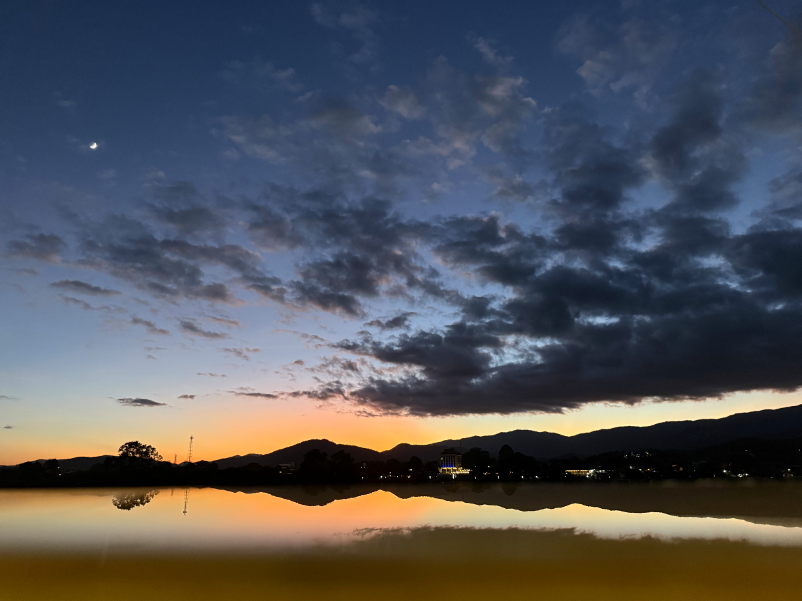
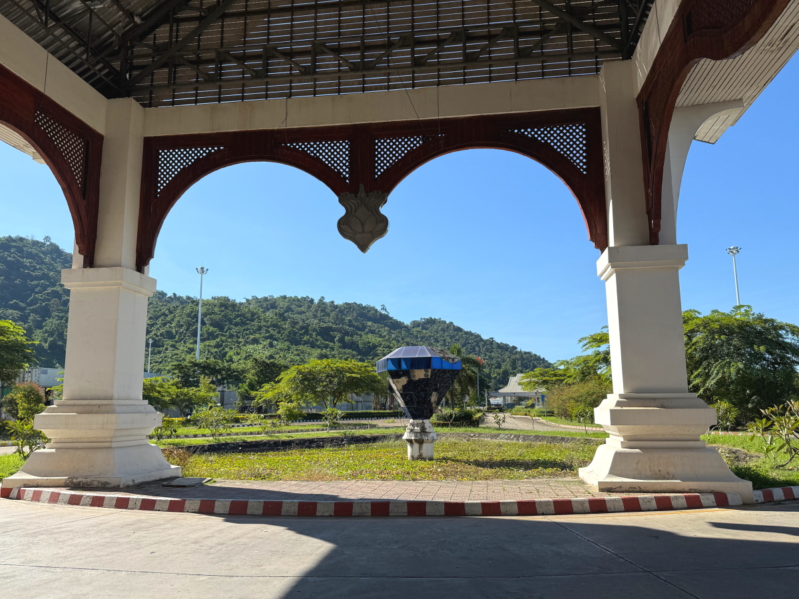
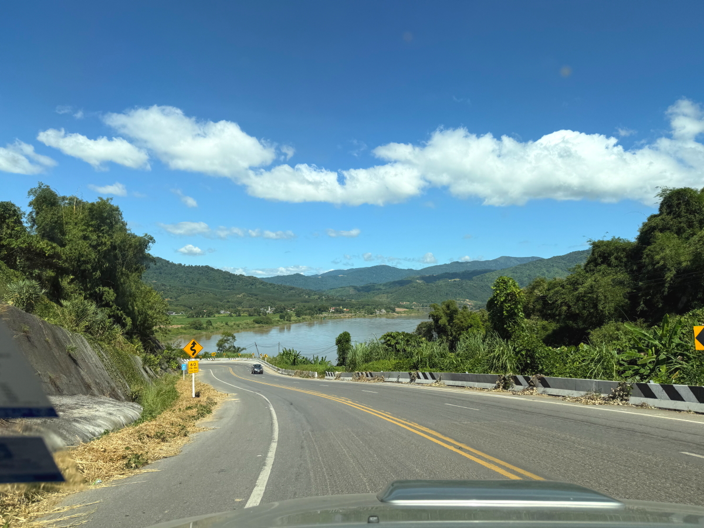
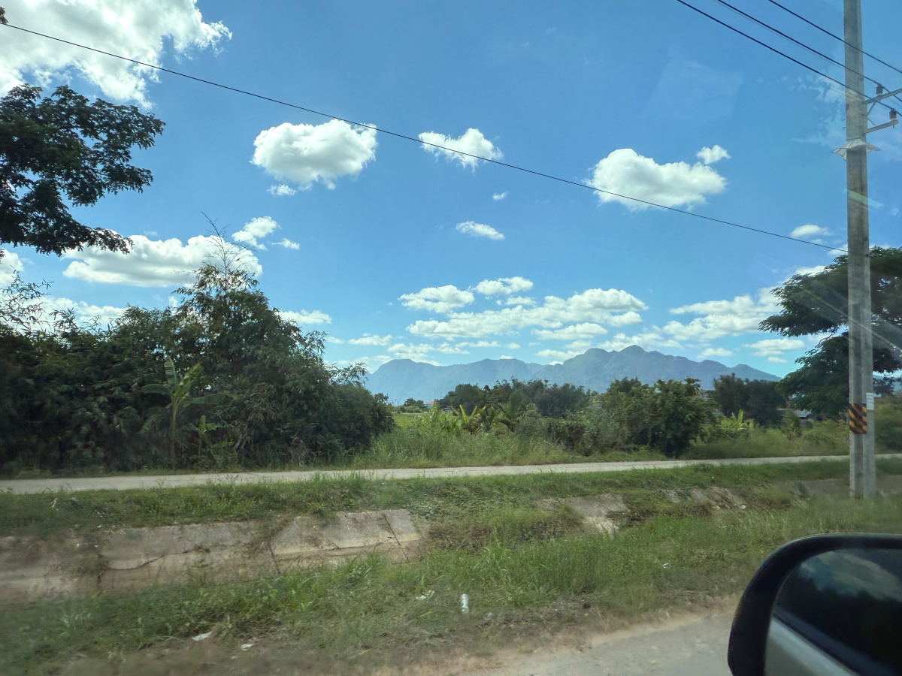

# 20251028_maechan

<html lang="ja" data-loaded="false" data-scrolled="false" data-spmenu="closed">
<head>

<meta charset="UTF-8">
<meta http-equiv="Content-Type" content="text/html; charset=UTF-8">
<meta http-equiv="X-UA-Compatible" content="IE=EmulateIE10" />
<meta http-equiv="X-UA-Compatible" content="IE=edge">

<meta name="viewport" content="width=device-width, initial-scale=1.0">

<!--ここから上はお決まりの定型文です-->

<!--ここからが表現の書式などを決めるcssという部分-->

<link href="https://cdnjs.cloudflare.com/ajax/libs/lightbox2/2.7.1/css/lightbox.css" rel="stylesheet">

</head>

<body>
    
<!--
    
<a href="https://torokoid.github.io/20250927_maechan/">Happy Birthday</a>><a href="https://torokoid.github.io/20250927__maechan/">Polis's Home></a>Polis's Home_2

-->

モバイル端末をお使いの場合は、画面を横向きにすると
背景画像の横方向がご覧頂けます。

<!--ここ上は、ほぼそのまま使います！-->

<!--QRコードの挿入例-->

 QR for Access

<marquee direction="left" scrollamount="20" width="30%">(^_^)/~Hada</marquee>

<!--流れ文字の挿入例-->
<h1><marquee behavior="left">!!! 2025/10/26-27 、ラオスの街の夕暮れから、タイ、メーチャンに戻ってほっとした夕焼け空まで !!!</marquee></h1>

                          

<!--ここから下が、本体部分-->
    

<h2>26,Oct,2025 ラオスの街の陽が傾きました</h2>

    
<h2>夕飯は宿の向かいの屋台です</h2>

    
<h2>宿泊した宿に夕陽が当たりました</h2>

    
<h2>隣の建物は熱帯っぽくピンク</h2>

    
<h2>白人さんがサトウキビジュースを買いに来てます</h2>

    
<h2>メコン川挟んで、タイに沈む夕陽</h2>

    
<h2>熱帯の薄味ビール</h2>

    
<h2>いつものサトウキビジュース</h2>

    
<h2>晩御飯の品々</h2>

    
<h2>メコン川を上るラオスの観光船</h2>

<iframe width="560" height="315" src="https://www.youtube.com/embed/dP80wrNV8nI?si=8vk2CrESa8PRq50x" title="YouTube video player" frameborder="0" allow="accelerometer; autoplay; clipboard-write; encrypted-media; gyroscope; picture-in-picture; web-share" referrerpolicy="strict-origin-when-cross-origin" allowfullscreen></iframe>
    

    
<h2>タイの山々に沈む夕陽が綺麗</h2>

    
<h2>メコン川は水面がざわついてるので、ちょっと細工してリフレクション撮影</h2>

    
<h2>川面ではなくて、手すりに撒いた水でリフレクション撮影です！</h2>

    
<h2>実際の景色はこちら</h2>

    
<h2>リフレクション撮影はクセになりそう</h2>

    
<h2>27,Oct,2025 朝日を浴びるタイの山々</h2>

    
<h2>これもリフレクション撮影</h2>

    
<h2>リフレクション撮影の仕組みは手すりの水</h2>

    
<h2>ロビーのチョコを一つ食べてみました</h2>

    
<h2>メーチャンから持参した果物もいただきます</h2>

    
<h2>中洲で漁師さんが作業してました</h2>

    
<h2>タイに戻るので、宿の経営者の親戚のお店によるも、開店休業中</h2>

    
<h2>空の卸業者から直接購入</h2>

    
<h2>ビール1ケースは、タイの半額</h2>

    
<h2>ラオス側の入管に到着</h2>

    
<h2>立派な仏壇が柱の影で見えず・・・</h2>

    
<h2>出国手続きが終わって、橋を渡るバス待ち</h2>

    
<h2>一緒にタイに入る一同、白人さんもいました</h2>

    
<h2>滅多に来れないので、記念撮影</h2>

    
<h2>池の蓮が咲いていました</h2>

    
<h2>ラオス側のホテルが新築中</h2>

    
<h2>橋を渡るバスは満席</h2>

    
<h2>メコン川を渡ってタイに入国</h2>

    
<h2>入国審査も無事終了</h2>

    
<h2>タイの空も快晴、義弟に迎えに来てもらいました</h2>

    
<h2>タイ側の国境の街に入ります</h2>

    
<h2>この建物はラオス側からよく見えていました</h2>

    
<h2>メコン川挟んで、ラオスから見えてた仏像様</h2>

    
<h2>ちょっと北に見えていたお寺はこちら</h2>

    
<h2>国道沿いのお寺の入り口の門</h2>

    
<h2>メコン川沿いにしばし西進</h2>

    
<h2>タイのなだらかな丘の畑、ここで作業したら足腰が強くなりそう</h2>

    
<h2>山間部の村の家々</h2>

    
<h2>丘を越えると、タイの平野部の穀倉地帯が見えてきます</h2>

    
<h2>丘を下ると、広大な平地が広がります</h2>

    
<h2>行きも見た仏像様</h2>

    
<h2>メコン川沿いに進んで、次の街に出ました</h2>

    
<h2>3日ぶりにタイのご飯</h2>

    
<h2>タイの仏壇は綺麗に祀られてます</h2>

    
<h2>ラオス西端のマンション群の街</h2>

    
<h2>タイ側からはここでも仏像様 ゴールデントライアングル、かつてケシの花を栽培して麻薬で栄えたエリアです 今は全てお茶畑になってます</h2>

    
<h2>国道を西北に進んでメーサイの街に向かいます</h2>

    
<h2>メーサイの街のチェンライ管轄の入管で、VISAの延長を再確認</h2>

    
<h2>入管の仏壇も綺麗でした</h2>

    
<h2>建物の上から見えた仏壇</h2>

    
<h2>メーサイの街を後にします</h2>

    
<h2>街の入り口にドンと構えるホテルの壁が仏教色</h2>

<!--

-->
    
<h2>メーチャンに無事戻って、市場で見かけた金魚たち</h2>

<iframe width="560" height="315" src="https://www.youtube.com/embed/08Qp5OmDVeo?si=W5pCSQq2DMgX2RfH" title="YouTube video player" frameborder="0" allow="accelerometer; autoplay; clipboard-write; encrypted-media; gyroscope; picture-in-picture; web-share" referrerpolicy="strict-origin-when-cross-origin" allowfullscreen></iframe>
    

<h2>3日ぶりに見たメーチャンの夕焼け</h2>

    

<h2>今回の全移動ルートはこんな感じでした</h2>

    

    
<!--

<iframe width="560" height="315" src="https://www.youtube.com/embed/51tmW4PV-Xw?si=v7PtzTJ3WaY8o6uJ" title="YouTube video player" frameborder="0" allow="accelerometer; autoplay; clipboard-write; encrypted-media; gyroscope; picture-in-picture; web-share" referrerpolicy="strict-origin-when-cross-origin" allowfullscreen></iframe>
    

<iframe width="560" height="315" src="https://www.youtube.com/embed/MvsoLLa-XHQ?si=-zvqXbodBPV2nEFE" title="YouTube video player" frameborder="0" allow="accelerometer; autoplay; clipboard-write; encrypted-media; gyroscope; picture-in-picture; web-share" referrerpolicy="strict-origin-when-cross-origin" allowfullscreen></iframe>
    

<h2>Short movies</h2>
https://youtube.com/shorts/773yijDWNEM?feature=share 
https://youtube.com/shorts/fXWujjVeAQo?feature=share 
https://youtube.com/shorts/43kwtgxybM8?feature=share 
https://youtube.com/shorts/jKhX0RtXWAk?feature=share 
https://youtube.com/shorts/Fqw8KGuUPtA?feature=share 
https://youtube.com/shorts/ieJlzaTlpn0?feature=share 
https://youtube.com/shorts/z8YXZQyPVMA?feature=share 
https://youtube.com/shorts/1MxKGMEFFR4?feature=share 
-->

         

  
<h2>今日のBGMは เพลย์ลิสต์คาเฟ่ฤดูใบไม้ร่วง ☕ เพลงชิลล์ฟังสบายยามเช้าเดือนตุลาคม | BGM สำหรับทำงานและเรียน</h2>

<iframe width="560" height="315" src="https://www.youtube.com/embed/VzIofaFJ0ug?si=wwvFnPab2JS3Cq89" title="YouTube video player" frameborder="0" allow="accelerometer; autoplay; clipboard-write; encrypted-media; gyroscope; picture-in-picture; web-share" referrerpolicy="strict-origin-when-cross-origin" allowfullscreen></iframe>
    

    
    
    

   
<h2>ラオスの街の夕暮れから、タイ、メーチャンに戻ってほっとした夕焼け空まででした Thank you for reading this far.</h2>

     
<h2>
<a href="https://torokoid.github.io/Mashiko_himawari_3/" target="_blank">クリックでメニューページに戻ります</a>
</h2>

    

   

<!-- hitwebcounter Code START -->
<a href="https://www.hitwebcounter.com" target="_blank">

you are visitor The numbers are cumulative for the Bangkok series websites launched since August 1st.
</a>   

         

  

      

<!--本体はここまで-->

<!--画面に空白地帯を作って、背景が見えるようにしています-->
                                              

<!-- フッタ -->
<footer>

Copyright 2025/10/28 S,Hada @Mae Chan

</footer>

<!--HPにさまざまなJavaScriptを呼び込むための書式-->

    
    </body>
    
</html>
